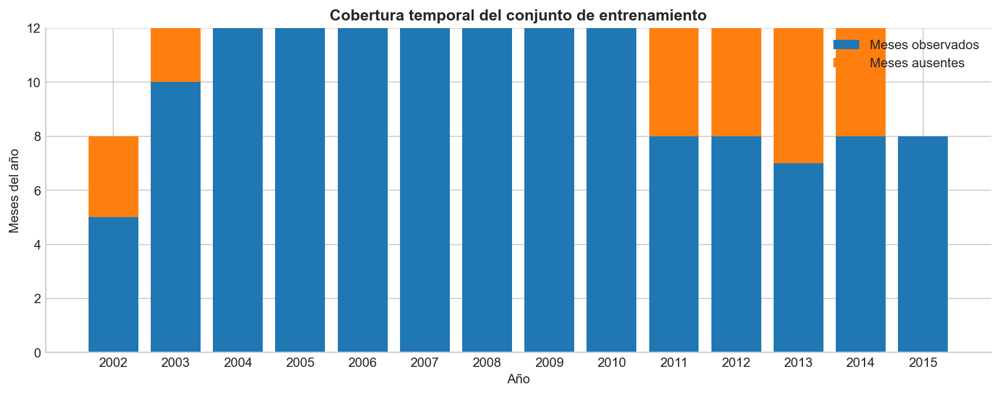
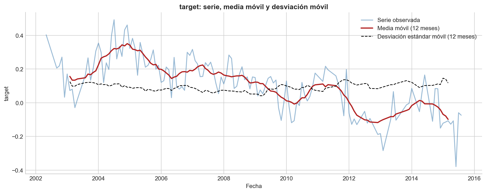
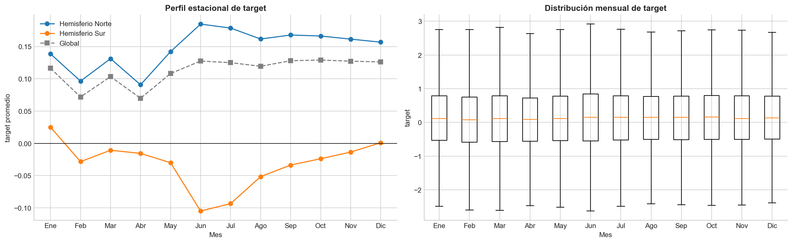
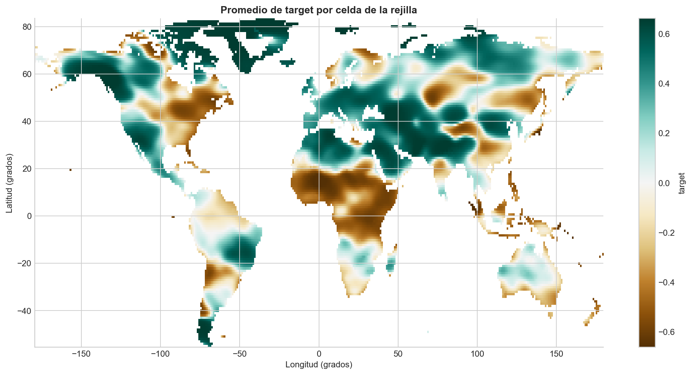
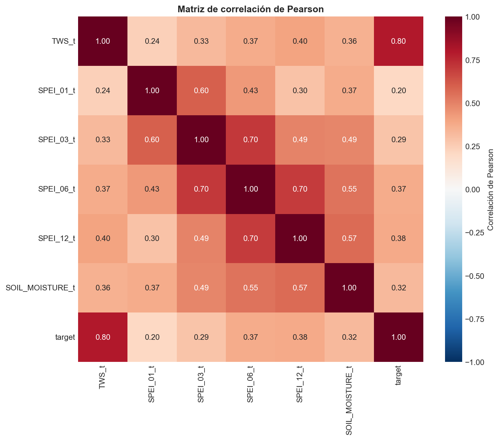

**Integrantes**

| # | Nombre | Carné |
| :-: | ------------------------------- | ---------- |
| 1 |  |  |
| 2 |  |  |
| 3 |  |  |
| 4 |  |  |

**Repositorio:** <https://github.com/Javiervalladares1/CC3084-Proyecto2-Drought-EDA>

```{=openxml}
<w:p><w:r><w:br w:type="page"/></w:r></w:p>
```

## Contenido

1. Introducción
2. Situación problemática
3. Problema científico
4. Objetivos
    - 4.1 Objetivo general
    - 4.2 Objetivos específicos
5. Contexto e investigación previa
    - 5.1 Qué es el Total Water Storage
    - 5.2 El SPEI
6. Descripción de los datos
    - 6.1 Variables
    - 6.2 Verificación de la variable objetivo
7. Limpieza y preprocesamiento
8. Análisis exploratorio
    - 8.1 Los faltantes están en el calendario, no en las celdas
    - 8.2 Distribuciones y estadística descriptiva
    - 8.3 Valores atípicos
    - 8.4 Comportamiento temporal y estacionalidad
    - 8.5 Análisis espacial
    - 8.6 Correlaciones
    - 8.7 Categorías de sequía
9. Hallazgos
10. Conclusiones
11. Próximos pasos
12. Referencias

```{=openxml}
<w:p><w:r><w:br w:type="page"/></w:r></w:p>
```

# 1. Introducción

Este informe presenta el análisis exploratorio de datos del reto *A Step Ahead of
Drought: Forecasting Global Water Storage Challenge*, organizado por la
International Telecommunication Union (ITU) junto con agencias del Sistema de
Naciones Unidas y alojado en la plataforma Zindi. El reto pertenece a la
categoría de **series de tiempo con datos satelitales**.

El objetivo de esta etapa no es construir el modelo de pronóstico, sino
comprender el fenómeno estudiado, la estructura del conjunto de datos y los
patrones que permitirán, en una fase posterior, plantear un modelo con criterio.

Todo el análisis es reproducible: el cuaderno `Proyecto2_Analisis_Exploratorio.ipynb`
se ejecuta de principio a fin sin errores y genera las tablas y figuras que aquí
se citan. El código, el notebook ejecutado y los entregables están versionados en:

> **<https://github.com/Javiervalladares1/CC3084-Proyecto2-Drought-EDA>**

A lo largo del documento se distingue explícitamente entre lo que se observa en
los datos y la información tomada de fuentes externas.

# 2. Situación problemática

El agua dulce disponible no está distribuida de manera uniforme ni es constante
en el tiempo. Su disponibilidad depende del balance entre la precipitación
recibida y las pérdidas por evapotranspiración y escorrentía, y ese balance se
acumula durante meses o años en el suelo, en los cuerpos de agua superficiales y
en los acuíferos. Cuando permanece negativo de forma prolongada aparece la
**sequía hidrológica**: una reducción sostenida del agua efectivamente almacenada
en un territorio.

El problema práctico es que esa reducción no se observa con facilidad. La lluvia
se mide bien, pero no describe por sí sola el estado del sistema: una región
puede recibir precipitación normal y seguir agotándose si la demanda evaporativa
es alta o si la extracción de agua subterránea excede la recarga. Medir
directamente el agua almacenada exigiría una red de observación que a escala
global no existe con cobertura suficiente.

Los datos satelitales cambian ese planteamiento. Las misiones **GRACE** (2002–2017)
y **GRACE-FO** (desde 2018) estiman el almacenamiento total de agua de forma
indirecta, midiendo variaciones del campo gravitatorio terrestre. Proporcionan
una variable comparable entre regiones que integra agua superficial y subterránea.

Sin embargo, esta solución trae una limitación operativa. Según la descripción
oficial del reto, los productos derivados de GRACE se publican con un **retraso de
aproximadamente 2 a 3 meses**. Para monitoreo y alerta temprana se necesita
conocer el estado actual del sistema, y lo disponible es el estado de hace un
trimestre: la información existe, pero llega tarde para sostener una decisión.

Anticipar el almacenamiento futuro no es trivial. El comportamiento del agua
almacenada no es homogéneo en el espacio; la señal combina tendencia,
estacionalidad y variabilidad interanual; las covariables de baja latencia
describen sobre todo la parte superficial del ciclo hidrológico, mientras el TWS
incluye componentes de respuesta lenta; y los registros satelitales presentan
interrupciones.

# 3. Problema científico

> **¿Qué patrones temporales, estacionales y espaciales presenta la anomalía de
> almacenamiento total de agua (TWS) en el conjunto de datos del reto, y qué
> variables satelitales y climáticas disponibles en el mes actual muestran mayor
> asociación con el TWS del mes siguiente, de manera que puedan sustentar la
> construcción de un modelo de pronóstico a un mes de horizonte?**

Se trata de una pregunta descriptiva y asociativa, no causal.

# 4. Objetivos

## 4.1 Objetivo general

Caracterizar, mediante un análisis exploratorio reproducible, el comportamiento
temporal, estacional y espacial de la anomalía de almacenamiento total de agua
(TWS) y de sus covariables en el conjunto de datos del reto, con el fin de
identificar los patrones y las variables que sustenten la construcción posterior
de un modelo de pronóstico a un mes de horizonte.

## 4.2 Objetivos específicos

1. **Describir** la estructura del conjunto de datos: observaciones, variables,
   tipos, y cobertura temporal y espacial.
2. **Evaluar** la calidad de los datos cuantificando valores faltantes,
   duplicados y valores extremos, determinando si responden a patrones
   temporales o espaciales antes de decidir su tratamiento.
3. **Analizar** el comportamiento temporal de la variable objetivo para
   determinar la existencia de tendencia, estacionalidad y periodos anómalos.
4. **Comparar** el comportamiento del almacenamiento entre ubicaciones
   geográficas.
5. **Determinar** el grado de asociación entre la variable objetivo, el
   almacenamiento del mes actual y las covariables climáticas.
6. **Identificar** las variables y transformaciones candidatas para la etapa
   posterior de modelado.

# 5. Contexto e investigación previa

## 5.1 Qué es el Total Water Storage

El **TWS** se define en la documentación del reto como todo el agua almacenada
sobre y bajo la superficie terrestre: agua subterránea, humedad del suelo, agua
superficial, nieve y hielo. Se expresa como **anomalía**, es decir, como
desviación respecto a una línea base histórica.

Las misiones GRACE y GRACE-FO no observan el agua directamente: miden variaciones
del campo gravitatorio terrestre. Como el agua tiene masa, un cambio en el
almacenamiento de una región modifica localmente la gravedad. De ahí se derivan
tres características que condicionan el análisis: resolución espacial del orden
de cientos de kilómetros, resolución temporal mensual, y una medida integrada en
profundidad que responde con más inercia que la lluvia.

## 5.2 El SPEI

El *Standardised Precipitation-Evapotranspiration Index* combina precipitación y
evapotranspiración potencial en un índice estandarizado. Se calcula a distintas
escalas de acumulación —en este conjunto, 1, 3, 6 y 12 meses—. Los valores
negativos indican déficit hídrico. Las escalas cortas reflejan sequía
meteorológica y agrícola; las largas se aproximan a la sequía hidrológica.

De aquí se derivó una **expectativa a verificar**: que las escalas largas del SPEI
se asocien más al TWS que las cortas, por la inercia del almacenamiento
subterráneo. La sección 8.5 muestra que los datos la respaldan.

# 6. Descripción de los datos

Los datos se distribuyen en formato plano: **una fila por combinación observada de
mes y celda** de una rejilla global.

| Aspecto | Valor observado |
| --- | --- |
| Observaciones de entrenamiento | 2 154 021 |
| Observaciones de prueba | 280 961 |
| Variables | 13 |
| Periodo de entrenamiento | mayo 2002 – agosto 2015 |
| Meses con observaciones | 138 |
| Celdas de la rejilla | 15 715 |
| Resolución espacial | 1° × 1° |
| Cobertura latitudinal | −55.5° a 83.5° |
| Cobertura longitudinal | −179.5° a 179.5° |

## 6.1 Variables

| Variable | Tipo | Papel |
| --- | --- | --- |
| `sample_id` / `ID` | texto | Identificador `AAAAMMDD_lat_lon` |
| `time` | fecha | Mes de observación |
| `lat`, `lon` | numérica | Centro de la celda, en grados |
| `TWS_t` | numérica | Almacenamiento total de agua del mes `t` |
| `SPEI_01_t`, `SPEI_03_t`, `SPEI_06_t`, `SPEI_12_t` | numérica | SPEI a 1, 3, 6 y 12 meses |
| `SOIL_MOISTURE_t` | numérica | Humedad del suelo del mes `t` |
| `month_sin`, `month_cos` | numérica | Codificación cíclica del mes, provista por la organización |
| `target` | numérica | **Variable objetivo**: TWS del mes `t+1` (solo train) |
| `TWS_t_masked` | booleana | Indicador de enmascaramiento (solo test) |

Un resultado que conviene destacar: **todas las variables numéricas están
estandarizadas y son adimensionales**. `target` tiene media 0.113 y desviación
0.912. No están en centímetros de lámina de agua, de modo que no admiten lectura
como volumen físico.

## 6.2 Verificación de la variable objetivo

En lugar de confiar en la descripción, se comprobó celda por celda cómo se
construyó `target`. El resultado es concluyente: coincide con el `TWS_t` del
registro siguiente en 1 977 398 filas **cuando el salto es exactamente de un mes**,
y en ninguna cuando el salto es mayor. Por lo tanto `target` corresponde siempre
al mes calendario `t+1`, no "al siguiente mes disponible".

# 7. Limpieza y preprocesamiento

La limpieza fue **conservadora**: se corrigieron tipos y se construyeron variables
derivadas, sin eliminar observaciones ni imputar valores.

**Tipos de datos.** `time` se convirtió con `pd.to_datetime()`; las 11 columnas
numéricas se convirtieron de `float64` a `float32`, lo que redujo la memoria de
252.1 MB a 161.7 MB sin pérdida de precisión relevante para variables geofísicas.

**Variables derivadas.** Se crearon año, mes y trimestre a partir de `time`;
`hemisferio` a partir del signo de la latitud; y `banda_latitud`, que agrupa las
celdas en ocho regímenes climáticos. Las dos últimas resultaron decisivas para
interpretar la estacionalidad.

**Valores faltantes.** No hay valores nulos en ninguna columna. El problema es de
otra naturaleza y se documenta en la sección 8.1.

**Duplicados.** Cero duplicados exactos, cero identificadores repetidos y cero
duplicados por la clave lógica (`time`, `lat`, `lon`).

**Valores extremos.** Se identificaron con el criterio del IQR y **no se
eliminaron**. La justificación se detalla en la sección 8.3.

# 8. Análisis exploratorio

## 8.1 Los faltantes están en el calendario, no en las celdas

El conteo de nulos da cero, pero eso no significa cobertura completa. Como el
formato es plano, un mes no observado simplemente no genera filas. Al comparar
contra el calendario completo aparece el verdadero problema:

- Del periodo mayo 2002 – agosto 2015 hay **160 meses de calendario** y solo **138
  con observaciones**: faltan **22 meses (13.8 %)**.
- Los años 2004 a 2010 están completos; 2011 a 2014 pierden entre 4 y 5 meses cada
  uno; 2002 pierde 3.
- El 0.68 % de las combinaciones celda-mes está ausente. El 92.6 % de las celdas
  tiene la serie completa; la de peor cobertura tiene 11 meses.



En el conjunto de prueba, de 40 meses de calendario solo hay **18** presentes, y el
**66.53 %** de las filas tiene `TWS_t` enmascarado. La documentación oficial aclara
que el enmascaramiento es deliberado, para impedir que el `TWS_t` de una fila
revele el objetivo oculto de otra.

## 8.2 Distribuciones y estadística descriptiva

| Variable | Media | Mediana | Desv. | Mín | Máx | Asimetría |
| --- | ---: | ---: | ---: | ---: | ---: | ---: |
| `TWS_t` | 0.117 | 0.132 | 0.913 | −3.968 | 4.057 | −0.088 |
| `SPEI_01_t` | −0.030 | −0.056 | 0.957 | −4.248 | 3.476 | 0.088 |
| `SPEI_03_t` | −0.055 | −0.076 | 0.944 | −5.225 | 4.177 | 0.078 |
| `SPEI_06_t` | −0.071 | −0.089 | 0.940 | −4.383 | 4.850 | 0.075 |
| `SPEI_12_t` | −0.093 | −0.114 | 0.931 | −4.622 | 3.765 | 0.081 |
| `SOIL_MOISTURE_t` | 0.001 | 0.001 | 0.788 | −5.107 | 5.385 | −0.142 |
| `target` | 0.113 | 0.127 | 0.912 | −3.968 | 4.057 | −0.088 |

Las distribuciones son unimodales y casi simétricas; media y mediana casi
coinciden en todas. Las medias de los SPEI son ligeramente negativas y se vuelven
más negativas conforme crece la escala de acumulación, indicio de déficit hídrico
sostenido de magnitud modesta. `SOIL_MOISTURE_t` es la variable más concentrada
(IQR 0.948) pero con el rango más amplio (10.49).

## 8.3 Valores atípicos

| Variable | Atípicos | % |
| --- | ---: | ---: |
| `SOIL_MOISTURE_t` | 55 481 | 2.58 % |
| `target` | 5 427 | 0.25 % |
| `TWS_t` | 5 343 | 0.25 % |
| `SPEI_12_t` | 727 | 0.03 % |
| `SPEI_01_t` | 687 | 0.03 % |
| `SPEI_03_t` | 552 | 0.03 % |
| `SPEI_06_t` | 537 | 0.02 % |

**Decisión: no se eliminó ninguno.** Los valores extremos de `target` llegan a
−3.97 y 4.06, magnitudes plausibles para anomalías estandarizadas; no hay valores
imposibles ni códigos centinela. Además, los atípicos **no se distribuyen al azar**:
se concentran en años y bandas de latitud concretos, patrón propio de eventos
hidrológicos reales y no de errores de medición. Por último, son justamente los
extremos los que el reto busca anticipar.

## 8.4 Comportamiento temporal y estacionalidad

**Hay una tendencia descendente sostenida.** El promedio anual de `target` cae de
0.322 en 2004 a −0.136 en 2015. La prueba de Dickey-Fuller aumentada da un
estadístico de −1.516 con **p-value 0.526**, por lo que no se rechaza la raíz
unitaria: la serie **no es estacionaria en media**. El resultado se sostiene con
promedio simple y con promedio ponderado por el coseno de la latitud
(correlación 0.936 entre ambas agregaciones).



**La descomposición aditiva reparte la varianza así:**

| Componente | Varianza | Proporción |
| --- | ---: | ---: |
| Serie completa | 0.0255 | 100 % |
| Tendencia | 0.0162 | 64 % |
| Residuo | 0.0046 | 18 % |
| Estacional | 0.0007 | 3 % |

**La estacionalidad global es casi nula, pero eso no significa que no exista.** El
perfil mensual por hemisferio muestra la causa: el hemisferio norte promedia
positivo los doce meses (0.091 a 0.185) mientras que el sur promedia negativo o
nulo (−0.105 a 0.025). Los ciclos son **opuestos** y se cancelan al promediarse.
El cruce banda × mes confirma ciclos mensuales definidos dentro de cada región.



Es un hallazgo metodológico relevante: **una serie agregada globalmente no es el
objeto adecuado para estudiar la estacionalidad de este fenómeno.**

## 8.5 Análisis espacial

El conjunto está fuertemente desbalanceado: el **80.3 %** de las observaciones
corresponde al hemisferio norte y la banda polar sur no tiene ninguna, reflejo de
la distribución real de tierra emergida.



| Banda de latitud | Observaciones | Media | Desv. |
| --- | ---: | ---: | ---: |
| Templada sur | 38 188 | 0.089 | 0.941 |
| Subtropical sur | 118 237 | −0.085 | 0.944 |
| Tropical sur | 267 636 | −0.022 | 0.928 |
| Tropical norte | 307 545 | **−0.222** | 0.855 |
| Subtropical norte | 223 897 | **0.327** | 0.845 |
| Templada norte | 662 020 | 0.120 | 0.916 |
| Polar norte | 536 498 | 0.318 | 0.869 |

La banda tropical norte es la de menor media y a la vez donde se registran el
mínimo (−3.968) y el máximo (4.057) absolutos del conjunto. Entre ella y la
subtropical norte hay una diferencia de más de medio punto, comparable a media
desviación estándar.

## 8.6 Correlaciones

| Variable | Pearson con `target` | Spearman | Diferencia |
| --- | ---: | ---: | ---: |
| `TWS_t` | **0.803** | 0.810 | 0.007 |
| `SPEI_12_t` | 0.380 | 0.364 | −0.016 |
| `SPEI_06_t` | 0.368 | 0.352 | −0.016 |
| `SOIL_MOISTURE_t` | 0.320 | 0.296 | −0.024 |
| `SPEI_03_t` | 0.285 | 0.274 | −0.011 |
| `SPEI_01_t` | 0.204 | 0.196 | −0.008 |



**La persistencia domina.** El almacenamiento del mes actual explica el
comportamiento del mes siguiente mucho mejor que cualquier covariable, y la
asociación se mantiene en todas las regiones (de 0.752 en tropical norte a 0.824
en templada norte).

**El orden de los SPEI sigue exactamente la escala de acumulación**, lo que
confirma la expectativa planteada en la sección 5.2. Las diferencias entre Pearson
y Spearman no superan 0.024, de modo que las relaciones son esencialmente
lineales.

**Línea base de persistencia:** predecir que el mes siguiente será igual al actual
produce **RMSE 0.5724** y MAE 0.4045, equivalente al 62.8 % de la desviación
estándar de la variable objetivo. Como la métrica del reto es el RMSE, ese es el
umbral concreto que cualquier modelo debe superar.

## 8.7 Categorías de sequía

Clasificando `SPEI_01_t` según la escala estándar del índice, el 66.9 % de las
observaciones es normal, el 17.3 % corresponde a sequía (11.6 % moderada, 4.8 %
severa, 0.9 % extrema) y el 15.8 % a condiciones húmedas.

La media de `target` crece de forma **monótona** a lo largo de las siete
categorías: −0.285 en sequía extrema, −0.248 severa, −0.117 moderada, 0.116
normal, 0.337 húmedo moderado, 0.467 húmedo severo y 0.602 húmedo extremo. La
dispersión dentro de cada categoría sigue siendo alta (desviaciones 0.888 a
0.930), señal de que el SPEI por sí solo está lejos de determinar el resultado.

# 9. Hallazgos

1. **Sin nulos ni duplicados, pero con faltantes estructurales.** Las 13 columnas
   están completas, pero faltan 22 de los 160 meses del calendario (13.8 %).
2. **Los meses ausentes se concentran en 2002–2003 y 2011–2014.** Los años 2004 a
   2010 están completos.
3. **`target` es el TWS del mes calendario `t+1`**, no el del siguiente mes
   disponible; verificado celda por celda.
4. **Las variables están estandarizadas y son adimensionales**; no admiten lectura
   como volumen físico.
5. **Hay tendencia descendente y la serie no es estacionaria** (ADF p = 0.526); la
   tendencia explica el 64 % de la varianza.
6. **La estacionalidad se cancela al agregar globalmente** por los ciclos opuestos
   de los hemisferios, pero existe a nivel regional.
7. **El conjunto está desbalanceado espacialmente** (80.3 % hemisferio norte) y las
   regiones difieren: de −0.222 en tropical norte a 0.327 en subtropical norte.
8. **La persistencia domina** (r = 0.803) y entre las covariables mandan las
   escalas largas del SPEI; la línea base a superar es RMSE 0.5724.

# 10. Conclusiones

El análisis cubrió los seis objetivos específicos planteados.

Se describió la estructura del conjunto: 2 154 021 observaciones de entrenamiento
sobre una rejilla global de 1° con 15 715 celdas, entre mayo de 2002 y agosto de
2015. Se evaluó la calidad y se encontró que el problema real no son los nulos
—no hay— sino la ausencia de 22 meses completos del calendario. Se analizó el
comportamiento temporal y se determinó que existe una tendencia descendente
sostenida y que la serie no es estacionaria en media. Se compararon las regiones y
se estableció que el promedio global no es representativo del comportamiento
local, lo que además explicó por qué la estacionalidad parecía ausente. Se
determinaron las asociaciones y se confirmó el predominio de la persistencia y el
ordenamiento de los SPEI por escala de acumulación.

**Limitaciones.** Las variables estandarizadas no admiten interpretación física en
unidades de volumen. La resolución de 1° describe escalas de cientos de kilómetros
y no permite conclusiones sobre cuencas pequeñas. El desbalance hemisférico hace
que toda métrica global esté dominada por el hemisferio norte. El análisis es
descriptivo y asociativo: **en ningún punto se establece causalidad**.

# 11. Próximos pasos

1. **Partir de la persistencia como línea base**: RMSE 0.5724 es la referencia que
   debe reportarse y superarse.
2. **Construir rezagos respetando los meses ausentes**: un `shift()` sobre el
   índice de filas produciría rezagos falsos, porque el registro anterior de una
   celda no siempre corresponde al mes anterior.
3. **Incorporar la dimensión regional** y validar por regiones además de
   globalmente. La organización advierte que latitud y longitud no deberían usarse
   directamente como predictores.
4. **Tratar la tendencia explícitamente**: diferenciar, incluir un término de
   tendencia o trabajar sobre residuos.
5. **Priorizar `SPEI_12_t` y `SPEI_06_t`** sobre las escalas cortas.
6. **Validar respetando el orden temporal**, con partición cronológica y nunca
   aleatoria.
7. **Manejar el enmascaramiento del conjunto de prueba**: el 66.53 % de las filas
   no tiene `TWS_t`, que es justamente la variable más predictiva; esa condición
   debe reproducirse en la validación.

# 12. Referencias

- Zindi / ITU. *A Step Ahead of Drought: Forecasting Global Water Storage
  Challenge.* <https://zindi.world/competitions/one-step-ahead-of-drought-forecasting-global-water-storage-challenge>
- Zindi / ITU. *StarterNotebook.ipynb* — documentación oficial del formato de datos
  y del enmascaramiento del conjunto de prueba.
- Copernicus European Drought Observatory. *GRACE Total Water Storage (TWS)
  Anomaly — Factsheet.*
  <https://drought.emergency.copernicus.eu/data/factsheets/factsheet_grace_tws_anomaly.pdf>
- Vicente-Serrano, S. M., Beguería, S. y López-Moreno, J. I. *SPEI: The
  Standardised Precipitation-Evapotranspiration Index.* <https://spei.csic.es/home.html>
- Universidad del Valle de Guatemala. *Guía del Proyecto 2 — Análisis
  Exploratorio*, CC3084 Data Science, Semestre II 2026.
- Material del curso CC3084: *Ejemplo series de tiempo LSTM*,
  *Practica01 Incendios* y *EjemploGIS Sentinel2*.
